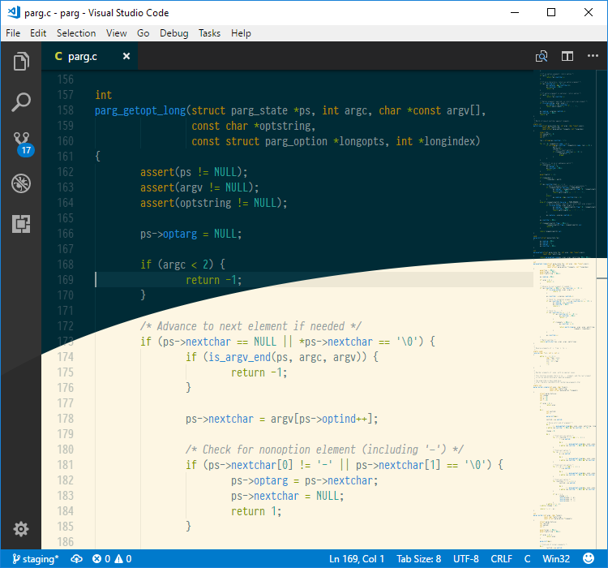

# Solarized Minimal for VS Code

[Solarized Minimal][solmin] is a color theme using the [Solarized][] palette
by Ethan Schoonover. One of the unique features of Solarized is that it
supports both a dark and light theme, using the same sixteen colors.

[Visual Studio Code][vscode] supports syntax highlighting based on the format
and grammar used in TextMate. This makes it possible to theme pretty much any
part of a document, but that doesn't necessarily mean you should.

Solarized Minimal attempts to create a more homogeneous and subtle use of
the Solarized palette by assigning colors primarily through the root groups
described in the [TextMate documentation][grammar].

[solmin]: https://jibsen.github.io/solarized-minimal/
[Solarized]: http://ethanschoonover.com/solarized
[vscode]: https://code.visualstudio.com/
[grammar]: http://manual.macromates.com/en/language_grammars.html

## Usage

Open the Extensions view `Ctrl+Shift+X` search for "Solarized Minimal" and
install the theme.

Now go to Preferences: Color Theme `Ctrl+K Ctrl+T` and select either theme
from the dropdown.
